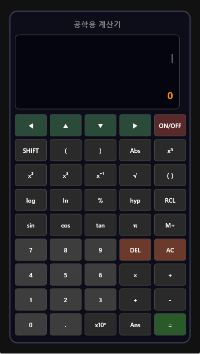
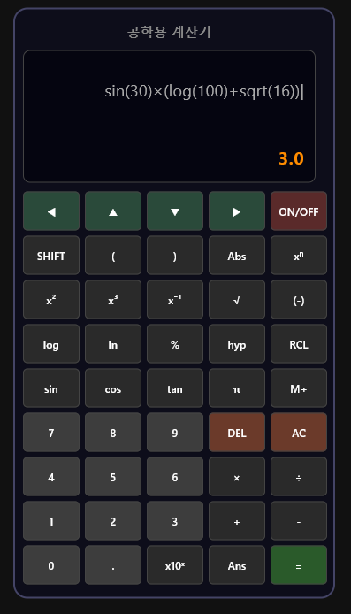
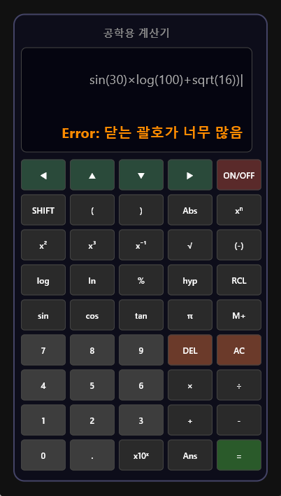
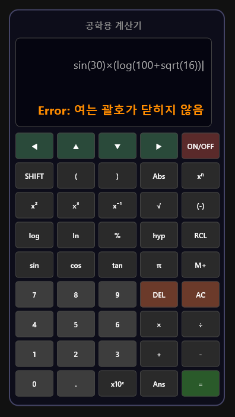

# 🧮 공학용 계산기
> Engineering Calculator built using Python & Flet

 

---

## 📌 소개

Python과 Flet 프레임워크를 사용하여 만든 공학용 계산기입니다.  
CASIO 공학용계산기를 참고하여 UI를 설계하였으며, 다양한 수학 함수를 지원합니다.

---

## 📷 실행 화면

| 시작 화면 | 계산 결과 |
|-----------|-----------|
|  |  |

| 괄호 오류 | 괄호 오류 |
|-----------|-----------|
|  |  |

---

## ✨ 주요 기능

- ➕ **사칙연산** — 덧셈, 뺄셈, 곱셈, 나눗셈
- 🔢 **괄호 계산** — 복잡한 수식의 괄호 처리 및 오류 감지
- 📐 **삼각함수** — sin, cos, tan / SHIFT 로 역삼각함수 (asin, acos, atan)
- 🔄 **쌍곡선함수** — hyp 버튼으로 sinh, cosh, tanh 전환 / hyp + SHIFT 로 asinh, acosh, atanh
- 📊 **로그함수** — log (상용로그), ln (자연로그)
- 🔺 **거듭제곱** — x², x³, xⁿ, x⁻¹
- 🔧 **기타 함수** — √ (루트), Abs (절댓값), % (퍼센트), π (파이 상수), e (자연상수)
- ⌨️ **커서 이동** — `◄` `►` 로 수식 내 원하는 위치로 이동 후 수정 가능
- 🕓 **계산 기록** — `▲` `▼` 로 이전 계산식 불러오기
- 💾 **메모리** — M+ (저장), RCL (불러오기)
- ⚠️ **오류 메시지** — 수식 오류, 괄호 오류, 0으로 나누기 등 원인 표시

---

## 🚀 설치 및 실행

### 요구사항
- Python 3.x
- Flet 0.80.0 이상

### 설치
```bash
pip install flet
```

### 실행
```bash
python engineering_calculator.py
```

---

## 🎮 사용법

### 기본 계산
```
2 + 3 = 5
(3 + 2) × 4 = 20
```

### 삼각함수
```
sin(30) = 0.5
cos(60) = 0.5
tan(45) = 1
```

### SHIFT 기능 (역삼각함수)
```
SHIFT 누르기 → 버튼이 asin / acos / atan 으로 전환
asin(0.5) = 30
```

### hyp 기능 (쌍곡선함수)
```
hyp 누르기 → 버튼이 sinh / cosh / tanh 으로 전환
sinh(1) = 1.1752011936
```

### hyp + SHIFT (역쌍곡선함수)
```
hyp 누르기 → SHIFT 누르기 → 버튼이 asinh / acosh / atanh 으로 전환
asinh(1) = 0.8813735870
```

### 로그
```
log(100) = 2
ln(e) = 1
```

### 거듭제곱 / 루트
```
2 xⁿ 8 = 256   (2^8)
√(16) = 4
```

### 퍼센트
```
50% = 0.5
100 × 20% = 20
```

### 커서 이동 및 계산 기록
```
◀ ▶ — 수식 내 커서를 좌우로 이동하여 원하는 위치 수정 가능
▲ ▼ — 이전/다음 계산식 불러오기
```

### 메모리
```
수식 입력 후 M+ → 결과 메모리 저장
RCL → 저장된 값 불러오기
```

### Ans (이전 결과)
```
계산 후 Ans 버튼 → 이전 결과값 수식에 삽입
예: 5 + 3 = 8 → Ans × 2 = 16
```


## 🗂️ 버튼 구성

| 구분 | 버튼 |
|------|------|
| **방향키** | `◄` `▲` `▼` `►` `ON/OFF` |
| **함수** | `SHIFT` `(` `)` `Abs` `xⁿ` `x²` `x³` `x⁻¹` `√` `(-)` `log` `ln` `%` `hyp` `RCL` `sin` `cos` `tan` `π` `M+` |
| **숫자** | `7` `8` `9` `4` `5` `6` `1` `2` `3` `0` `.` `x10ˣ` `Ans` `=` |
| **연산자** | `×` `÷` `+` `-` `DEL` `AC` |

---

## 🔁 SHIFT / hyp 전환표

| 모드 | 버튼 |
|------|------|
| **기본** | `sin` `cos` `tan` `√` `ln` `Abs` |
| **SHIFT** | `asin` `acos` `atan` `x²` `e^` `n!` |
| **hyp** | `sinh` `cosh` `tanh` |
| **hyp + SHIFT** | `asinh` `acosh` `atanh` |
---

## 🛠️ 기술 스택

- **Language** — Python 3
- **UI Framework** — Flet
- **Math Library** — Python math 모듈

---

## 👩‍💻 개발자

- GitHub: [@Jenny5789](https://github.com/Jenny5789)
